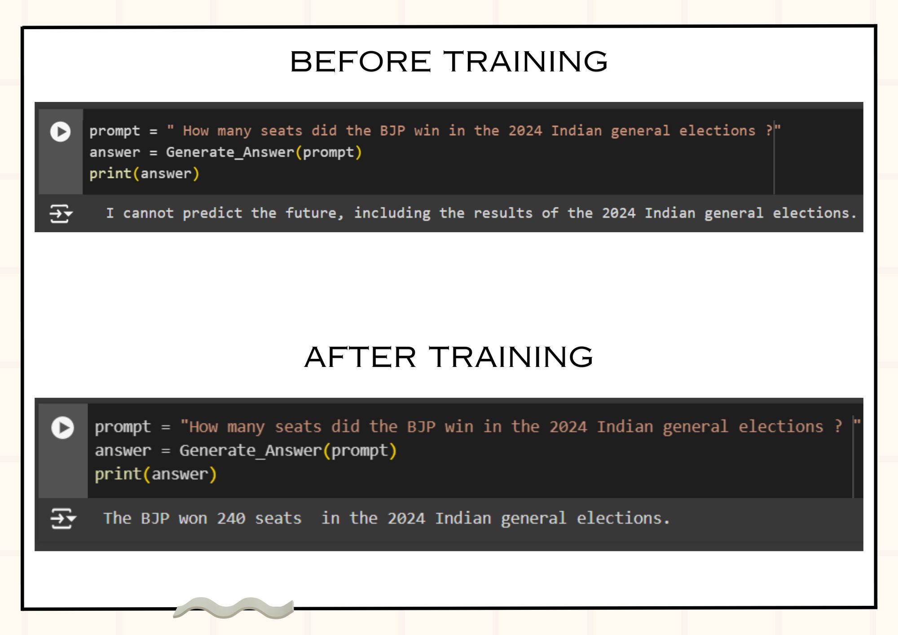
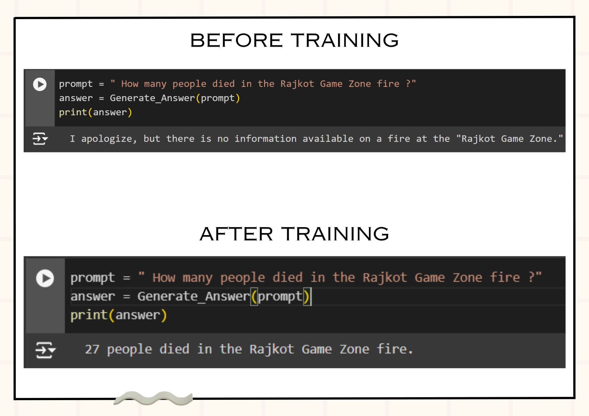

# 🌟 Fine-Tuning Llama-2-7b for Enhanced Insights 🦙

Welcome to the repository for my project, where I fine-tuned the LLM model, Llama-2-7b, to provide enhanced insights into the **2024 Indian Elections** 🇮🇳 and the **Rajkot TRP Game Zone fire accident** 🔥.

## 🚀 Project Overview

This project demonstrates significant improvements in Llama-2-7b's ability to respond with nuanced insights after fine-tuning. By training the model on specific datasets related to real-world events, we achieved substantial performance enhancements in the model’s predictions and response accuracy.

## 🔍 Data Collection & Training Process

- **Data Sources**: A wide variety of online sources were used to compile a robust dataset, focusing on:
  - The Indian Election 2024 🇮🇳
  - Rajkot TRP Game Zone fire accident 🔥
- **Training**: Fine-tuned the Llama-2-7b model using the following technologies:
  - Hugging Face 🤗
  - Google Colab 🛠️
  - Torch 🔥
  - Transformers 🧩
  - LoRA (Low-Rank Adaptation) 📉
  - Pipelines 🔄

## 💻 Technologies Used

- **Hugging Face**: For model and dataset management.
- **Torch**: Core deep learning framework used for training.
- **Transformers**: Hugging Face’s transformer models were utilized to fine-tune the Llama-2-7b.
- **LoRA**: Implemented LoRA for efficient fine-tuning with minimal resource usage.
- **Pipelines**: For streamlining the model's outputs.

## 🌐 Real-World Impact

Fine-tuned models like **Llama-2-7b** can:
- Provide more **accurate political predictions** for upcoming elections.
- Deliver **detailed emergency information** in crisis situations, improving decision-making during accidents like the TRP Game Zone fire.

## 📊 Results

The fine-tuned model exhibits the following improvements:
- Enhanced context understanding for event-specific data.
- More accurate and relevant responses to queries about the election and the fire incident.

## 🔗 Explore the System

- **Dataset**: [Election 2024 & TRP Game Zone Fire Dataset on Hugging Face](https://huggingface.co/datasets/GJN08/India_election_2024_and_TRP_game_zone_fire_event)
- **Fine-tuned Model**: [Fine-tuned Llama-2-7b Model on Hugging Face](https://huggingface.co/GJN08/llama_2_finetuned_on_election_2024_trp_game_zone)

## 👥 Community Acknowledgements

Special thanks to the communities behind:
- **Google Colab**
- **Hugging Face**
- **Python**

Their open-source tools and frameworks were critical in making this project a reality.

## 📫 Contact

For more information, explore more of my projects on [GitHub](https://github.com/Gohil-Jayrajsinh/).

## 🔗 **Connect with Me**

If you're passionate about AI and its real-world applications, feel free to connect with me:

 

Let’s push the boundaries of technology and make an impact! 🚀

## 🙏 **Thank You**

Thank you for taking the time to explore this project!  
I truly appreciate your interest, and I hope this project inspires you to explore the exciting world of AI and Machine Learning. 

Feel free to reach out if you have any questions, feedback, or suggestions. Let’s learn and grow together!

---